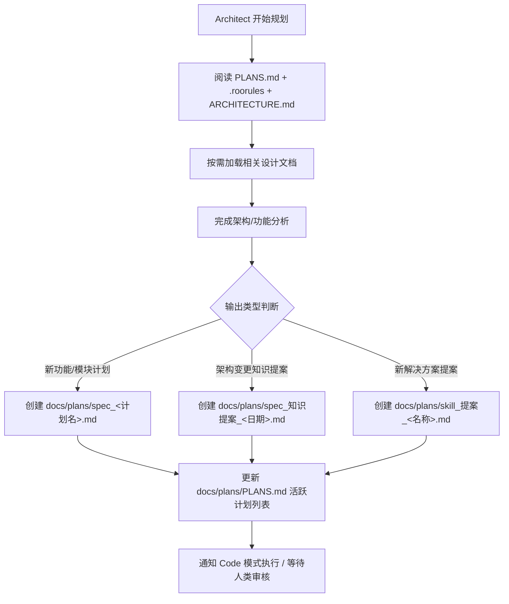

# 🏗️ Harness 架构指南（Architect 模式专属）

> **目的**：让 Architect 模式了解 **OpenAI AGENTS.md 模式的 Harness 架构约定**，并在架构规划后正确输出计划与设计文档。  
> **本文件按 Harness 架构模式编写**，可复制到任何采用同样架构的项目中直接使用。

---

## 1. Harness 架构约定

采用 **OpenAI AGENTS.md 模式**，文件结构约定如下：

```
📁 <project-root>/
├── .roorules                    # AGENTS.md · 总路由（渐进式披露入口）
├── ARCHITECTURE.md              # 系统架构（技术栈、目录结构、数据流、缓存、容灾）
├── docs/
│   ├── design/                  # 📐 领域设计文档（按 Domain 模块拆分）
│   │   ├── <domain_a>_domain.md # 各业务域设计文档
│   │   ├── <domain_b>_domain.md
│   │   ├── shared_kernel.md     # 共享内核设计（通用基础设施）
│   │   ├── development_framework.md  # 开发框架（EPCC Flow、TDD 纪律、红线约束）
│   │   └── business_boundary.md # 业务边界（已实现 & 待规划）
│   ├── plans/                   # 📋 计划文档（规划 + 知识提案归档）
│   │   └── PLANS.md             # 计划总览（活跃计划 & 已完成计划）
│   └── prompt/                  # 🤖 AI Agent Prompt 模板（开发时编写）
├── skills/                      # 🔧 RooCode Skills（专项解决方案）
├── src/                         # 源码（DDD 分层）
│   └── <domain>_domain/
│       ├── application/         # 应用层（服务编排）
│       ├── core/                # 核心层（业务逻辑/算法）
│       └── infrastructure/      # 基础设施层（数据访问/外部集成）
├── config/                      # YAML 配置体系
└── tests/                       # 测试目录
```

> 💡 **约定即架构**：上述目录结构为 Harness 架构的**推荐模式**，各项目可根据实际需求增减。关键约束是 `.roorules`（AGENTS.md 总路由）必须存在。

---

## 2. 架构规划输出规范

### 2.1 架构/功能规划完成后

| 输出类型 | 目标文件（相对项目根目录） | 说明 |
|----------|---------------------------|------|
| **新功能/模块计划** | `docs/plans/spec_<计划名>.md` | 创建计划文档 |
| **系统架构变更** | `ARCHITECTURE.md` | 更新系统级架构描述 |
| **业务设计变更** | `docs/design/` 下对应文件 | 更新领域级设计文档 |
| **知识提案** | `docs/plans/spec_知识提案_<日期>.md` | 架构变更的知识归纳提案 |
| **新解决方案提案** | `docs/plans/skill_提案_<名称>.md` | 新技术方案的技能提案 |

> **不输出** `docs/prompt/`（开发时编写，不属于规划产出）

### 2.2 计划文档模板

```markdown
# 计划：[计划名称]

## 目标
（一句话描述本次计划要达成的目标）

## 涉及文件清单
- `路径`: 变更说明

## 执行步骤
1. Step 1：...
2. Step 2：...

## 预期产出
- 产出 1
- 产出 2

## 风险评估
- 风险 1：...
```

---

## 3. 前置操作

开始架构规划前，**必须按顺序执行**：

1. **阅读 [`docs/plans/PLANS.md`](docs/plans/PLANS.md)（如果存在）** — 了解当前已有计划，避免重复
2. **阅读 [`.roorules`](.roorules)** — 了解总路由中的渐进式披露表，确定需要加载哪些文档
3. **阅读 [`ARCHITECTURE.md`](ARCHITECTURE.md)** — 了解系统架构全景
4. **根据任务类型，从 `.roorules` 的披露表中查询并加载对应的设计文档**
   - 披露表定义了每个文档的用途和何时阅读的条件
   - 只加载任务相关的文档，避免一次性加载全部内容（渐进式披露原则）

---

## 4. 输出流转规则



---

## 5. 与 Code 模式的协作

| 阶段 | Architect 职责 | Code 职责 |
|------|----------------|-----------|
| **规划** | 分析需求、输出 Plan / Design 文档 | — |
| **实施** | — | 读取 Plan / Design 进行编码 |
| **验证** | 审核实施结果是否符合设计 | 运行测试、确保 100% PASS |
| **总结** | — | 执行知识归纳流程 |

> **关键约束**：Architect 模式不直接修改代码文件。架构变更需通过 `docs/plans/` 中的提案或计划文件传递给 Code 模式执行。

---

## 6. 协作流（EPCC Flow）

```
Explore → Plan → Code → Commit
```

1. **Explore（探索）** — 分析需求、查询现有文档（从 `.roorules` 披露表加载）
2. **Plan（规划）** — 输出计划到 `docs/plans/`，设计文档到 `docs/design/`
3. **Code（编码）** — 读取 Plan 并实施
4. **Commit（提交）** — 测试验证、知识归纳、提交

> EPCC Flow 的详细说明通常在 [`docs/design/development_framework.md`](docs/design/development_framework.md) 中定义。
