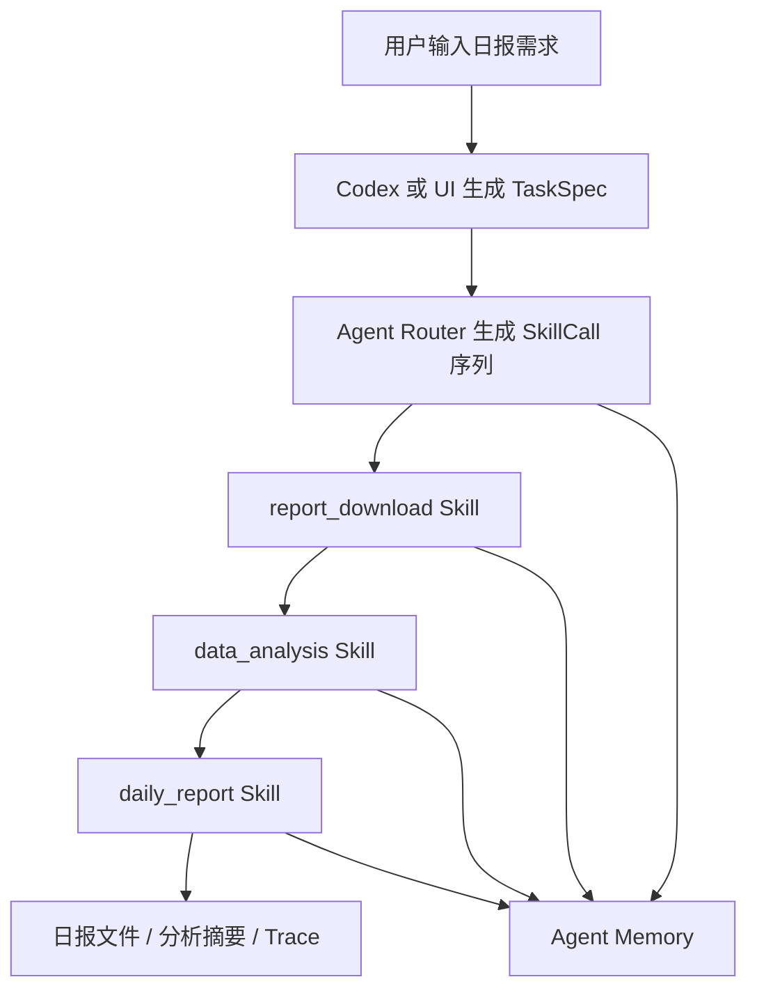

# Agent 项目目标架构

## 1. 结论

当前项目不再以传统 DDD 分层作为最终形态，而是迁移到更适合 Codex/Agent 调用的结构：

```text
用户需求
  -> TaskSpec
  -> Agent Runtime
  -> Skill Tool
  -> SkillResult
  -> Trace / Memory / Output
```

DDD 分层仍可作为旧实现的内部组织方式继续存在，但不再作为 Codex 理解项目和调用能力的第一入口。新的第一入口是：

- `Spec`：任务契约，记录用户目标、输入、筛选条件、分析要求和输出要求。
- `Skill`：可被 Codex 或运行时调用的稳定能力。
- `Runtime`：负责按 Spec 编排 Skill、记录状态、处理失败与重试。
- `Trace`：记录每一步输入、输出、错误和产物路径。
- `Memory`：保存已确认的用户需求、报表、字段、分析逻辑和模板映射。

## 2. 架构判断

用户提出的方向基本合理：

| 判断 | 结论 |
|------|------|
| 三个业务模块是否适合转为 Skill | 适合。`report_download`、`data_analysis`、`daily_report` 是天然的纵向能力模块。 |
| 是否应由 Spec 驱动固定流程 | 应该。Spec 比写死的 orchestrator 更适合自然语言修改和运行追踪。 |
| 是否应把 Agent 核心迁移给 Codex | 适合当前阶段。Codex 擅长读写项目文件、调用本地工具、修复失败流程。 |
| 是否应让 LLM 直接处理全部业务 | 不应该。重复、高频、可测试流程仍应沉淀为 Python 工具。 |
| 是否应马上引入 LangGraph/CrewAI | 暂不建议。当前复杂度更适合轻量 Runtime 和明确接口。 |

## 3. 目标目录

```text
excel-generator-project/
├── app/
│   └── main.py
├── specs/
│   ├── templates/
│   │   └── daily_report_spec.yaml
│   └── runs/
│       └── <run_id>/
│           ├── spec.yaml
│           ├── trace.jsonl
│           └── outputs/
├── src/yield_report/
│   ├── agent/
│   │   ├── spec_model.py
│   │   ├── router.py
│   │   ├── runtime.py
│   │   ├── memory.py
│   │   └── trace.py
│   ├── skills/
│   │   ├── report_download/
│   │   │   ├── SKILL.md
│   │   │   ├── models.py
│   │   │   ├── tool.py
│   │   │   └── implementation.py
│   │   ├── data_analysis/
│   │   │   ├── SKILL.md
│   │   │   ├── models.py
│   │   │   ├── tool.py
│   │   │   └── analyzers/
│   │   └── daily_report/
│   │       ├── SKILL.md
│   │       ├── models.py
│   │       ├── tool.py
│   │       └── implementation.py
│   ├── adapters/
│   │   ├── finereport/
│   │   ├── excel/
│   │   └── llm/
│   ├── shared/
│   │   ├── config.py
│   │   ├── files.py
│   │   └── errors.py
│   ├── application/
│   ├── core/
│   ├── infrastructure/
│   └── legacy/
│       └── excel_generator_project/
├── docs/agent/
│   ├── architecture.md
│   ├── skill_contract.md
│   └── spec_contract.md
└── tests/
    ├── unit/agent/
    ├── unit/skills/
    └── integration/
```

## 4. 模块职责

### 4.1 Agent 层

`src/yield_report/agent/` 是 Codex 和 Python 工具之间的轻量运行时。

| 模块 | 职责 |
|------|------|
| `spec_model.py` | 定义 `TaskSpec`、`SkillCall`、`SkillResult`、`RunContext`。 |
| `router.py` | 将用户需求或 Spec 转换为待执行的 Skill 调用序列。 |
| `runtime.py` | 执行 Skill、管理状态、处理失败、写入 checkpoint。 |
| `memory.py` | 统一访问跨任务记忆，复用已确认记录。 |
| `trace.py` | 写入步骤日志、产物路径、错误详情和运行摘要。 |

Agent 层不直接操作浏览器、Excel 或 FineReport；这些能力必须通过 Skill Tool 调用。

### 4.2 Skill 层

`src/yield_report/skills/` 是项目的主要能力入口。每个 Skill 都是一个纵向切片，包含模型、工具入口、实现和 Codex 可读说明。

| Skill | 业务能力 | 现有实现迁移方向 |
|-------|----------|------------------|
| `report_download` | 根据报表类型、日期、型号下载或定位源表 | 包装 `DataAcquisitionOrchestrator`、`FinereportClient`、`LocalFileLoader`。 |
| `data_analysis` | 根据分析需求读取文件、解密、分析、生成结构化结论 | 包装 `AnalysisOrchestrator`、文件解析器、分析器和 memory。 |
| `daily_report` | 根据分析结果和模板生成 Excel 日报 | 新模块，复用 V1 写表、样式和模板经验。 |

Skill 内部可以继续使用原 `application/core/infrastructure` 代码，直到迁移稳定。

### 4.3 Adapter 层

`src/yield_report/adapters/` 放外部系统适配器。

| Adapter | 职责 |
|---------|------|
| `finereport/` | FineReport RPA、下载、筛选条件、导出。 |
| `excel/` | Excel 解密、schema 提取、读写、模板填充。 |
| `llm/` | LLM 调用、JSON 解析、重试和模型路由。 |

Adapter 不承载业务流程，只提供清晰的外部能力。

### 4.4 Shared 层

`src/yield_report/shared/` 放项目内部通用工具，例如路径解析、错误类型和配置访问。跨领域通用能力仍可保留在 `src/shared_kernel/`，但 `yield_report` 内部高频工具应逐步收敛到 `shared/`。

## 5. 运行流程



## 6. Codex 调用约定

Codex 作为外部 Agent 核心时，应优先按以下顺序工作：

1. 阅读 `.roorules` 和 `docs/agent/architecture.md`。
2. 根据用户自然语言创建或更新 `specs/runs/<run_id>/spec.yaml`。
3. 通过 `src/yield_report/agent/router.py` 或具体 `skills/*/tool.py` 调用稳定工具。
4. 将运行日志写入 `specs/runs/<run_id>/trace.jsonl` 或运行时配置指定位置。
5. 只在稳定工具能力不足时，才由 Codex 临时分析、修复或补充代码。

## 7. 迁移策略

Task2 应采用低风险增量迁移：

| 阶段 | 目标 | 说明 |
|------|------|------|
| P1 | 新增 `agent/` 和 `skills/` 外壳 | 已完成：不删除旧模块，只增加 Codex 友好的调用入口。 |
| P2 | 包装报表下载 Skill | 已完成：`report_download/tool.py` 调用现有下载编排。 |
| P3 | 包装数据分析 Skill | 已完成：`data_analysis/tool.py` 调用现有分析编排。 |
| P4 | 开发日报生成 Skill | 已预留稳定接口：具体 V2 生成逻辑后续接入。 |
| P5 | UI 收敛到 Agent 工作台 | 从三个 tab 渐进迁移到“输入 -> Spec -> 步骤 -> 结果”。 |
| P6 | 清理旧分层 | 测试稳定后再移动或删除 `application/core/infrastructure`。 |

## 8. 测试策略

| 测试类型 | 目标 |
|----------|------|
| `tests/unit/agent/` | Spec 解析、路由、运行状态、失败恢复、trace 写入。 |
| `tests/unit/skills/` | 每个 Skill 的输入/输出模型和工具入口。 |
| `tests/integration/` | 给定 Spec，完成下载、分析、日报生成的最小闭环。 |
| UI 烟测 | 单输入框提交日报需求，页面展示 Spec、步骤和结果。 |
| 回归测试 | 保留现有报表下载、数据分析、解密、代码执行测试。 |

## 9. 决策边界

- Codex 是外部 Agent 核心，不嵌入 Python 服务。
- Python 项目负责提供稳定工具、Spec 契约、运行记录和产物。
- 暂不引入 LangGraph、CrewAI 等编排框架。
- DDD 分层不是立即废弃，而是作为兼容实现逐步被 Skill 包装和吸收。
