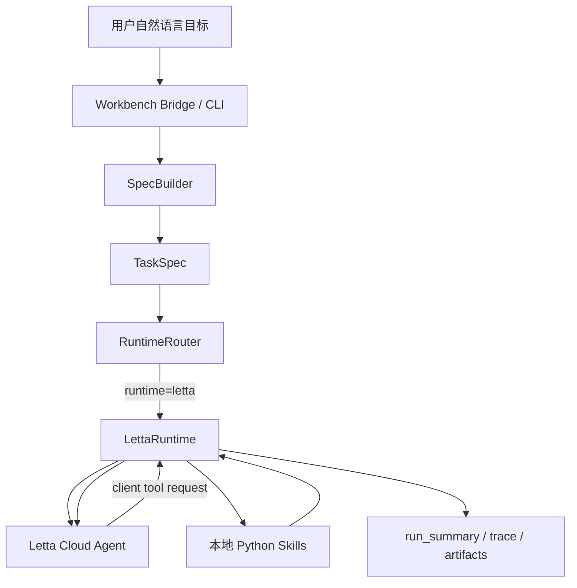

# Agent Runtime 框架机制与实现说明

生成日期：2026-06-22

## 1. Agent 能否复用

可以复用，而且当前 Runtime 已经按“复用优先，新建兜底”的方式实现。

Letta Cloud 免费版 Agent 数量有限时，不建议为每个任务创建一个新 Agent。正确方式是：

- 复用一个长期 Cloud Agent 作为业务 Agent Runtime 容器；
- 每个 TaskSpec run 创建或复用独立 conversation；
- 任务状态写入 `current_task` memory block；
- 长期经验候选写入 archival passages，失败时不影响主任务；
- 本地 `run_summary.json`、`trace.jsonl`、artifacts 仍作为业务侧事实源。

当前 Agent ID 解析优先级：

1. `LettaRuntime(agent_id=...)` 显式传入值。
2. `config/global.yaml` 中的 `agent.letta.agent_id`。
3. 环境变量 `LETTA_AGENT_ID`。
4. 本地缓存 `.agent_workbench/letta_agent_id`。
5. 以上都没有时，才调用 Letta Cloud 创建新 Agent，并写入缓存。

因此，当前云平台已经有 3 个 Agent 时，建议立即固定复用其中一个 Agent：

```env
LETTA_AGENT_ID=agent-xxxxxxxx
```

也可以写入项目配置：

```yaml
agent:
  letta:
    agent_id: "agent-xxxxxxxx"
```

如果不想把 ID 写入配置文件，可以只保留项目根目录下的 `.agent_workbench/letta_agent_id`。但要注意：临时 workspace、测试 workspace、复制出来的目录不会自动带这个缓存，最好使用 `LETTA_AGENT_ID` 环境变量做全局复用。

## 2. 总体架构



关键原则：

- Letta Cloud 负责 stateful Agent、messages、memory blocks、archival memory、conversation、compaction、tool selection。
- 本项目 Runtime 负责 TaskSpec、Skill 白名单、本地 Excel/RPA/文件访问、artifact 路径、run trace、业务事实源。
- Cloud Agent 不直接读取企业本地文件；它只通过 client tools 请求本地 Runtime 执行。

## 3. 主要模块

| 模块 | 路径 | 职责 |
|---|---|---|
| Workbench Bridge | `scripts/agent_workbench_bridge.py` | UI/JSON 入口；支持 `create_spec`、`run_spec`、`create_and_run` |
| SpecBuilder | `src/yield_report/agent/spec_builder.py` | 将自然语言目标转换为 TaskSpec |
| RuntimeRouter | `src/yield_report/agent/runtime_adapter.py` | 根据 requested runtime、TaskSpec constraints、全局默认配置选择 Runtime |
| LettaRuntime | `src/yield_report/agent/letta_runtime.py` | Letta Cloud 适配器；管理 Agent、conversation、memory、client tools、trace |
| Python Skill Runtime | `src/yield_report/agent/runtime.py` | 本地确定性 Skill 执行器 |
| Skill Registry | `src/yield_report/agent/registry.py` | 注册 `report_download`、`data_analysis`、`daily_report` 等业务 Skills |
| Config Model | `src/shared_kernel/config_model.py` | Letta Runtime 配置字段模型 |
| Global Config | `config/global.yaml` | Letta Runtime 默认配置 |

## 4. Runtime 调度规则

`RuntimeRouter` 的选择顺序：

1. 用户显式传 `--runtime letta` 或 bridge payload 中 `runtime=letta`，直接使用 LettaRuntime。
2. 用户显式传 `python`、`omp`、`pi`，使用对应 Runtime。
3. TaskSpec 中 `constraints.runtime=letta`，使用 LettaRuntime。
4. `requested_runtime=auto` 时，读取 `config/global.yaml` 中 `agent.default_runtime`。
5. 默认仍为 `python`，避免未准备好的环境自动调用 Cloud。

当前配置片段：

```yaml
agent:
  default_runtime: "python"
  letta:
    enabled: false
    agent_id: ""
    agent_id_cache_path: ".agent_workbench/letta_agent_id"
    model: "my-glm-key/glm-5.1"
    embedding: "my-glm-key/text-embedding-3-large"
    sync_memory_blocks: true
    archive_memory_candidates: true
    use_conversations: true
    compaction_mode: "sliding_window"
    compaction_clip_chars: 50000
    streaming: true
    stream_tokens: false
    background_runs: false
    timeout_seconds: 900
    max_tool_rounds: 20
```

## 5. LettaRuntime 执行流程

一次 `run_spec(spec, context)` 的核心步骤：

1. 创建 Letta SDK client。
2. 解析 Agent ID：优先复用显式配置、环境变量或本地缓存。
3. 如果必须新建 Agent，则配置 model、embedding、memory blocks、compaction settings。
4. 更新已有 Agent 的 model、embedding、compaction settings。
5. 同步 memory blocks。
6. 为当前 run 创建或复用 conversation。
7. 根据 TaskSpec workflow 过滤 client tools。
8. 将 TaskSpec prompt 发送给 Letta Cloud。
9. Letta 请求 client tool 时，本地 Runtime 执行业务 Skill。
10. 将工具结果作为 approval/tool_return 返回 Letta。
11. 收集 final assistant message。
12. 写 `letta_summary.md`、`run_summary.json`、`memory_candidates.json`、trace。
13. 尝试将 memory candidates 写入 Letta archival passages；失败不影响主任务。

## 6. Agent 复用与 Conversation 隔离

Cloud Agent 是长期容器，不应按任务频繁创建。当前隔离策略是：

- 一个 Cloud Agent 复用长期 persona、policy、domain contract 和记忆；
- 每个 TaskSpec run 使用一个 conversation；
- conversation ID 缓存在 `.agent_workbench/letta_conversations/<run_id>`；
- `run_summary.json` 记录 `letta_agent_id`、`letta_conversation_id`、`letta_run_id`。

这使得免费版 3 个 Agent 的限制不会阻止多任务运行。真正增长的是 conversations，而不是 agents。

注意：如果在临时 workspace 中运行，而没有设置 `LETTA_AGENT_ID`，Runtime 会因为找不到 `.agent_workbench/letta_agent_id` 而尝试新建 Agent，可能触发 Cloud 限额。因此生产/日常使用建议设置 `LETTA_AGENT_ID`。

## 7. Memory 机制

当前同步的 memory blocks：

| Block | 说明 | 更新策略 |
|---|---|---|
| `persona` | Agent 身份和职责 | Runtime 同步 |
| `runtime_policy` | 工具使用、安全边界、事实源规则 | 只读策略块 |
| `domain_contract` | OLED 良率报告业务契约摘要 | 只读策略块 |
| `current_task` | 当前 TaskSpec run 摘要 | 每次运行刷新 |
| `memory_digest` | 可复用运行经验摘要 | 如果已有内容则不覆盖 |

长期经验写入：

- 本地 Skill 返回 `SkillResult.memory_updates`；
- Runtime 尝试写入 `client.agents.passages.create(...)`；
- tags 使用 `runtime`、`memory_candidate`、`pending/confirmed/...`；
- 如果 Cloud archival 写入失败，只写 trace，不影响本次业务分析结果。

业务事实源仍然是本地：

- `specs/runs/<run_id>/spec.yaml`
- `run_summary.json`
- `trace.jsonl`
- `outputs/*`
- Excel 源文件与分析 artifact

## 8. Tool / Skill 机制

Letta Cloud 看到的是 client tool schema，真实执行在本地 Runtime。

当前 client tools：

| Letta tool | 本地 Skill | 用途 |
|---|---|---|
| `yield_report_download` | `report_download` | 下载或定位良率源报表 |
| `yield_data_analysis` | `data_analysis` | 执行趋势、恶化、原因等数据分析 |
| `yield_daily_report` | `daily_report` | 生成日报产物 |

Runtime 会根据 TaskSpec workflow 过滤工具：

- 纯 `data_analysis` 任务只暴露 `yield_report_download` 和 `yield_data_analysis`；
- `daily_report` 任务才暴露 `yield_daily_report`；
- 这样可以避免 Cloud Agent 在“只要求分析”时误调用日报生成。

字段适配：

- Letta tool schema 使用 `analysis_goal`；
- 本地 `DataAnalysisRequest` 使用 `question`；
- Runtime 会将 `analysis_goal` 归一为 `question`；
- 如果目标中包含“趋势 / 变化 / 波动 / 恶化”，会补 `analysis_intent=trend`。

## 9. 黑箱验证结论

已通过的黑箱目标：

```text
请分析M678最近三个月的月度良率变化趋势；如果有恶化，请给出恶化原因
```

验证方式：

- 使用真实 Letta Cloud Agent；
- 通过 Workbench bridge 的 `create_and_run` 入口；
- 使用临时 workspace 和 M678 月度良率 Excel 夹具；
- Runtime 复用已有 Cloud Agent，避免创建新 Agent；
- Cloud Agent 只调用 `yield_data_analysis`，没有误调用 `yield_daily_report`。

验证输出：

- run summary: `output/blackbox_letta_real/20260622_043708/specs/runs/blackbox-m678-monthly-real-letta/run_summary.json`
- result artifact: `output/blackbox_letta_real/20260622_043708/specs/runs/blackbox-m678-monthly-real-letta/outputs/data_analysis_result.md`

关键通过条件：

- `response_success=true`
- `runtime=letta`
- `data_analysis_step_success=true`
- `daily_report_not_called=true`
- 结果包含 `M678 最近3个月月度良率变化趋势`
- 结果包含 `恶化判断: 末期良率低于首期，存在恶化`
- 结果包含 `恶化原因线索`

## 10. 当前风险与建议

### 必须复用 Agent

Cloud 免费版达到 3 个 Agent 后，不要依赖自动创建。建议在 `.env` 中固定：

```env
LETTA_AGENT_ID=agent-xxxxxxxx
```

### 临时 workspace 要特别注意

`.agent_workbench/letta_agent_id` 是 workspace 相对缓存。临时目录没有该缓存时会尝试新建 Agent。自动化测试、临时 smoke、复制项目目录时应显式设置 `LETTA_AGENT_ID`。

### 不建议把企业 Excel 上传 Letta Cloud

当前设计通过 client tools 本地读取 Excel，只把摘要和 artifact reference 返回给 Letta。这个边界应继续保持。

### Archival memory 是增强项

归档失败不应阻断主分析。当前已经实现 best-effort，失败会写 trace。

### 后续可优化

1. 将 `PROJECT_CLIENT_TOOLS` 从硬编码改为由 Skill registry 生成。
2. UI 接入 streaming event 和 background run resume。
3. 明确多用户身份模型后，再引入 `human` block 或 Letta identities。
4. 对 Cloud Agent 增加定期 health check，验证 model、embedding、memory blocks 和工具 schema 是否仍兼容。

## 11. 相关验证命令

```bash
uv run pytest tests/unit/agent tests/unit/skills tests/unit/test_config_loader.py::TestAppConfigModel::test_agent_letta_config -q
uv run pyright src/yield_report/agent/letta_runtime.py src/yield_report/agent/runtime_adapter.py src/shared_kernel/config_model.py tests/unit/agent/test_agent_workbench_blackbox.py tests/unit/agent/test_letta_runtime.py tests/unit/test_config_loader.py
uv run ruff check src/yield_report/agent/letta_runtime.py src/yield_report/agent/runtime_adapter.py src/shared_kernel/config_model.py tests/unit/agent/test_agent_workbench_blackbox.py tests/unit/agent/test_letta_runtime.py tests/unit/test_config_loader.py
```

最近一次结果：

- 75 passed
- pyright: 0 errors, 0 warnings
- ruff: All checks passed
