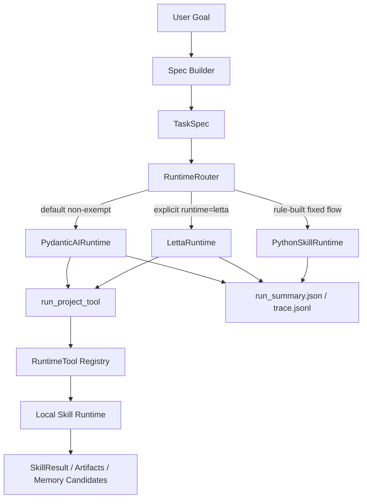

# Agent Runtime Pydantic AI Migration

Generated: 2026-07-02

## Purpose

This document records the migrated Agent Runtime architecture after replacing the default Letta runtime with a lightweight Pydantic AI runtime. The LangGraph-based Spec Builder is intentionally unchanged.

## Runtime Topology



## Preserved Boundaries

- Spec Builder remains the existing LangGraph graph package under `src/yield_report/agent/spec_graph/`.
- Letta remains available as an explicit optional runtime through `runtime=letta` and `--runtime letta`.
- Rule-built fixed `daily-report` and `anomaly-monitor` specs still use the deterministic Python Skill runtime exemption.
- Local Skills remain the business execution boundary: `report_download`, `data_analysis`, `daily_report`, and `anomaly_monitor`.

## New Default Runtime

`PydanticAIRuntime` is now the default Agent Runtime for non-exempt TaskSpecs.

Key files:

- `src/yield_report/agent/pydantic_ai_runtime.py`
- `src/yield_report/agent/runtime_adapter.py`
- `src/yield_report/agent/client_tools.py`
- `src/shared_kernel/config_model.py`
- `config/global.yaml`

The runtime uses Pydantic AI for the agent loop and exposes a single controlled tool:

```text
run_project_tool(tool_name: str, arguments: dict)
```

The tool is fail-closed:

- `tool_name` must be selected from the current TaskSpec workflow.
- `arguments` are validated by each Skill's existing Pydantic request model.
- actual execution is delegated to the existing local Skill runtime.
- outputs are normalized back into `SkillResult`, `ArtifactRef`, and memory candidate files.

## Shared Runtime Tool Registry

`client_tools.py` now owns provider-neutral runtime tool selection.

The shared workflow mapping is:

| Workflow skill | Runtime tools |
|---|---|
| `report_download` | `yield_report_download` |
| `data_analysis` | `yield_report_download`, `yield_data_analysis` |
| `daily_report` | `yield_daily_report` |
| `anomaly_monitor` | `yield_anomaly_monitor` |

Letta and Pydantic AI both consume this registry, reducing schema and whitelist drift.

## Configuration

Default configuration now uses:

```yaml
agent:
  default_runtime: "pydantic_ai"
  pydantic_ai:
    model: "deepseek-chat"
    base_url: "https://api.deepseek.com"
    api_key_env: "DEEPSEEK_API_KEY"
```

Letta configuration is retained under `agent.letta`.

## Why Pydantic AI Fits This Runtime

Official Pydantic AI documentation describes Agents as containers for instructions, function tools/toolsets, structured output, dependencies, model settings, and reusable capabilities. Function tools can be registered with decorators or the `tools=` argument, and model execution supports `run_sync()`. Pydantic AI also supports OpenAI-compatible providers through `OpenAIChatModel` and `OpenAIProvider`.

References:

- https://pydantic.dev/docs/ai/core-concepts/agent/
- https://pydantic.dev/docs/ai/tools-toolsets/tools/
- https://pydantic.dev/docs/ai/models/openai/

## Migration Guarantees

- Letta code was not deleted.
- Spec Builder code path was not migrated.
- Existing `TaskSpec`, `RunContext`, `SkillCall`, `SkillResult`, `TraceEvent`, and artifact contracts remain intact.
- Runtime summaries still write `run_summary.json` and `memory_candidates.json`.
- Pydantic AI dependency is the lightweight OpenAI-compatible package: `pydantic-ai-slim[openai]`.

## Next Architecture Step

This migration creates a stable default Runtime. It does not yet implement a full Codex-like skill harness that reads arbitrary `SKILL.md` files and independently decides CLI calls.

The recommended next layer is an `AgenticSkillRuntime` on top of this foundation:

- discover installed skills from approved skill roots.
- read `SKILL.md` through a controlled tool.
- expose a narrow command runner for whitelisted skill CLIs.
- validate results into `SkillResult`.
- keep all command outputs under run-scoped artifacts.

That layer should reuse the same fail-closed trace, artifact, and memory contracts introduced here.
