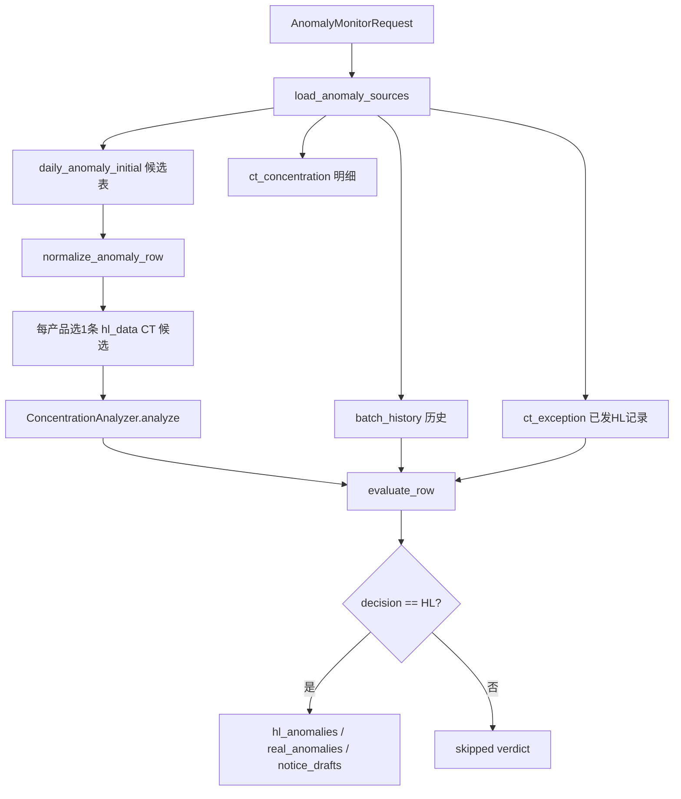

# anomaly_monitor 当前异常筛选逻辑

生成时间：2026-07-06

分析范围：

- `src/yield_report/skills/anomaly_monitor/tool.py`
- `src/yield_report/skills/anomaly_monitor/implementation.py`
- `src/yield_report/skills/anomaly_monitor/sources.py`
- `src/yield_report/skills/anomaly_monitor/analyzers.py`
- `src/yield_report/skills/anomaly_monitor/templates.py`
- `src/yield_report/skills/anomaly_monitor/models.py`
- 参考单测：`tests/unit/skills/test_anomaly_monitor_skill.py`

## 总览

`anomaly_monitor` 是一个固定业务流：读取当日异常候选、补齐 CT 明细与历史良损数据、执行确定性规则判定，最后输出 HL 异常与通报草稿。

当前筛选可以概括为：

1. 从共享目录或调用方内联数据加载源表。
2. 构建 `daily_anomaly_initial` 候选异常表。
3. 归一化候选行字段。
4. 对 `hl_data` 来源的 CT 候选，每个产品只选 1 条最优先候选。
5. 对每条候选计算集中性、历史规格上限、是否已 HL。
6. 按固定顺序判定 `HL` 或 `skipped`。
7. 只有 `decision == "HL"` 的行进入 `hl_anomalies`、`real_anomalies` 和通报草稿。



## 数据源加载

入口是 `tool.run()`，它调用 `execute_anomaly_monitor()`；后者第一步调用 `load_anomaly_sources()`。

请求模型 `AnomalyMonitorRequest` 支持两类输入：

- 内联行数据：`initial_rows`、`ct_exception_rows`、`batch_history_rows`、`detail_rows`。
- 文件别名：`source_files`，例如 `data_source_dir`、`spotfire`、`hl_raw`、`batch_yield`、`hl_history`、`ct_yield`、`mwdl_raw`、`defect_group_dict`、`ct_exception`。

默认共享目录为：

```text
\\10.71.7.15\大数据共享\12.良率监控日报自动化
```

当没有内联数据，并且 `source_files` 为空或显式提供了 `data_source_dir` 时，代码会把共享目录展开成以下默认文件：

| 别名 | 默认文件 |
| --- | --- |
| `hl_raw` | `hl_data.csv` |
| `batch_yield` | `batch_yield_data.csv` |
| `hl_history` | `hl_csv_data.csv` |
| `ct_yield` | `ct_yield_data.csv` |
| `mwdl_raw` | `mwdl_data.csv` |
| `defect_group_dict` | `imp_ct_dft_group.csv` |

默认当日过货产品表为：

```text
D:\wzy\工作-值班工作\相关文件\resources\spotfire.xlsx
```

产品过滤逻辑：

- 如果请求显式传入 `product_models`，使用请求值。
- 否则尝试读取 `spotfire` 第一列作为当日过货产品。
- 如果没有 `spotfire` 或读取失败，则记录 warning，并使用全部候选产品。
- 产品支持组合型号拆解，例如 `C546&C547` 会保留组合值，并额外提取 `C546`、`C547` 用于匹配。

## 候选异常表构建

最终参与判定的候选表是 `sources["daily_anomaly_initial"]`。

### 1. 内联候选

如果请求传入 `initial_rows`，它们会直接作为初始候选。

如果同时提供了 `product_models`，内联候选会按产品型号过滤。

### 2. `hl_data.csv` 构建候选

当没有内联候选且存在 `hl_raw` 时，代码调用 `_build_hl_candidates()` 从 `hl_data.csv` 构建候选。

主要处理步骤：

- 将 `ratio`、`batch_ratio`、`lag_ratio`、`month_ratio`、`ng_qty` 转成数字。
- 计算 `batch_gap = batch_ratio - lag_ratio`；字段缺失时为 `0`。
- 计算 `multiplier = batch_ratio / month_ratio`；月良损为 `0` 时为 `0`。
- 如果存在 `interface_time`，按时间倒序排序，再按 `prod_code + defect_desc + oper_group` 分组取最新一条。
- 从 `hl_history` 合并 `HL次数`、`最新hl时间`、`hl原因` 等历史字段。
- 从 `batch_yield` 按 `prod_code + batch/sub_prod_id` 合并 `lot_input_ratio`。
- 按当日产品过滤。
- 调用 `_attach_occurrence_station()` 记录同产品同不良的非 CT 发生站点，但后续最终判定仍使用 `oper_group` 归一化后的 `station`。
- 每条记录设置 `source_table = "hl_data"`。

### 3. `mwdl_data.csv` 补漏候选

只要存在 `mwdl_raw`，代码都会调用 `_build_mwdl_candidates()` 追加补漏候选。

补漏候选的核心目的：`hl_data.csv` 中没有出现，但 `mwdl_data.csv` 的 LOT 级记录仍满足基础异常特征时，补入候选池。

补漏规则：

- 先按 `product_models` 过滤。
- 将 `ng_qty`、`input_qty`、`ratio` 转成数字。
- 构造已存在候选键：`prod_code + defect_desc + oper_group`。
- 只扫描 `date_type == "LOT"` 的行。
- LOT 行必须满足：
  - `ratio > 0.001`
  - `ng_qty > 20`
  - `prod_code`、`defect_desc`、`oper_group` 非空
  - 相同 `prod_code + defect_desc + oper_group` 不在已有候选中
  - 存在同产品、同不良、同站点的 `DAY` 汇总行
- 可选读取同键的 `MONTH`、`WEEK` 汇总行，用于填充 `month_ratio`、`week_ratio`。
- 从 `batch_yield` 读取 `lot_input_ratio`。
- `batch_gap` 直接设置为当前 `batch_ratio`。
- `multiplier = batch_ratio / month_ratio`；没有月汇总时为 `0`。
- 同一 `prod_code + defect_desc + oper_group` 多条 LOT 候选时，选择 `(batch_ratio, ng_qty)` 最大的一条。
- 每条记录设置 `source_table = "mwdl_data"`。

### 4. 历史良损表

当请求没有内联 `batch_history_rows` 且存在 `mwdl_raw` 时，代码调用 `_build_mwdl_history()` 从 `mwdl_data.csv` 构建 `batch_history`。

历史表处理：

- 直接基于 `mwdl_data.csv` 全量行构建。
- 将 `ng_qty`、`input_qty`、`ratio` 转成数字。
- 从 `defect_group_dict` 按 `defect_code` 合并 `defect_group`。
- 从 `batch_yield` 按 `prod_code + date_value/sub_prod_id` 合并 `lot_input_ratio`。
- 每条记录设置 `source_table = "mwdl_data"`。

当前历史上限计算没有日期窗口过滤；后续会在同产品、同不良内取历史最大 `ratio`。

### 5. CT 集中性明细

`ct_yield` 文件会被加载为 `ct_concentration`，来源通常是 `ct_yield_data.csv`。

构建逻辑：

- 只保留 `ng_qty > 0` 的 CT 良率明细行。
- 如果存在 `panel_id`，要求长度大于 4。
- 从 `panel_id` 最后 4 位拆出：
  - `row_code = panel_id[-4:-2]`
  - `col_code = panel_id[-2:]`
  - `membrane_pos = row_code + "-" + col_code`
- 每条记录设置 `source_table = "ct_yield_data"`。

## 字段归一化

每条候选会被 `normalize_anomaly_row()` 转成 `NormalizedAnomalyRow`。

关键字段映射：

| 归一化字段 | 源字段 |
| --- | --- |
| `product_model` | `prod_code`、`产品型号`、`产品` |
| `defect_desc` | `defect_desc`、`不良名称`、`不良` |
| `defect_code` | `defect_code`、`DefectCode`、`不良代码` |
| `station` | `oper_group`、`发生站点`、`不良站点`、`站点`，并转大写 |
| `batch` | `batch`、`批次`、`date_value` |
| `batch_date` | 显式字段或从 `batch` 解析 |
| `daily_loss` | `ratio`、`日良损`、`daily_loss` |
| `month_loss` | `month_ratio`、`CT月`、`当月`、`monthly_loss` |
| `week_loss` | `week_ratio`、`CT周`、`当周`、`weekly_loss` |
| `batch_loss` | `batch_ratio`、`本批次`、`batch_loss` |
| `batch_gap` | `batch_gap`、`本批次-上批次` |
| `batch_output_ratio` | `lot_input_ratio`、`批次产出率`、`batch_output_ratio` |
| `multiplier` | `multiplier`、`倍数`；缺失时用 `batch_loss / month_loss` |
| `ng_qty` | `ng_qty`、`不良数量` |

比例解析规则：

- 数字直接转 `float`。
- `"0.12%"` 会转为 `0.0012`。
- 非百分号但绝对值大于 `1` 的数字，也按百分比除以 `100`。

## HL 源表候选优先级

在正式判定前，`execute_anomaly_monitor()` 会调用 `_mark_selected_hl_source_rows()`。

当前规则：

- 只处理 `source_table == "hl_data"` 且 `station == "CT"` 的候选。
- 按 `product_model` 分组。
- 每个产品只选择一条最优先的 `hl_data` CT 候选。
- 排序键为：
  1. `daily_loss`
  2. `batch_loss`
  3. `batch_gap`
  4. `ng_qty`
- 被选中的候选会在原始行上标记 `_source_hl_selected = True`。

这意味着同一个产品如果 `hl_data.csv` 中有多条 CT 异常候选，只有上述排序最高的一条可以走“源表 HL 初筛命中”；其他 `hl_data` CT 候选会在最终判定中直接跳过。

`mwdl_data` 补漏候选不参与这个“一产品一条”的源表候选选择。

## 基础门槛

`evaluate_row()` 中的基础门槛如下：

| 检查项 | 条件 |
| --- | --- |
| 批次良损 | `batch_loss > 0.001`，即大于 `0.1%` |
| 批次产出率 | `batch_output_ratio > 0.20`，即大于 `20%` |
| 倍数 | `multiplier > 0.30` |
| NG 数量 | `ng_qty > 20` |

`gate_passed = 四项全部通过`。

## 集中性判定

集中性由 `ConcentrationAnalyzer` 判断。

### 明细匹配

先按以下键查找 CT 明细：

- 优先：`product_model + defect_code + batch`
- 其次：`product_model + defect_desc + batch`
- 兜底：扫描全部明细，匹配产品、批次、不良代码或不良名称

如果候选原始文本中已经存在 `concentration_text`、`notice_text` 或 `异常通报`，且文本包含“集中”或“聚集”，会直接作为集中性证据。

### 强集中性

当前检查维度：

- Lot：`lot_id`、`lot`
- Map：`membrane_pos`、`map`、`膜位`
- Map 行：`row_code`、`行`
- Sheet：`sheet_id`、`sheet`
- Glass：`glass_id`、`glass`
- 工单：`work_order`、`工单`

每个维度统计值分布，计算：

- `top_1_ratio = Top1 数量 / 明细总数`
- `top_unit_count = floor(不同单元数量 * 0.20)`，最少为 `1`
- `top_unit_ratio = Top N 动态单元累计数量 / 明细总数`

判定为强集中性的条件：

- 明细总数 `>= 20`，且满足以下任一项：
  - `top_1_ratio >= 0.50`
  - `top_unit_ratio >= 0.80`
- 或明细总数 `< 20` 且 `top_1_ratio >= 0.80`

输出集中对象时，只保留 Top10 中满足以下条件的对象：

- 对象数量 `>= 4`
- 对象数量 `>= Top1 数量 * 0.4`

只要任一维度强集中，`ConcentrationEvidence.detected = True`，例如：

```text
Map集中: 1F-E0/2F-E0
```

### 轻度 MAP 集中

如果没有强集中性，会尝试生成轻度 MAP 文案，但它不触发 `detected = True`。

条件：

- 明细行必须有有效 `output_panel_id`，或 `output_qty > 0`。
- 有效明细行数 `>= 20`。
- Top2 `membrane_pos` 累计占比 `>= 0.45`。
- Top2 各自数量都 `>= 4`。

满足后输出：

```text
MAP较集中: 1FE0/2FE0
```

注意：轻度 MAP 集中只影响通报草稿中的基础分析文本，不会单独让候选成为 HL。

## 历史规格上限

`calculate_spec_result()` 使用 `batch_history` 判断是否超过 CT 历史上限。

逻辑：

- 按 `product_model + defect_desc` 查找历史记录。
- 如果存在 CT 站点历史记录，优先只用 CT 历史。
- 否则使用同产品同不良的所有历史。
- 取所选历史记录中 `ratio`、`ratio_fanel` 或 `不良率` 的最大值作为 `spec_ratio`。
- `exceeds_spec = row.batch_loss > spec_ratio`。

当前实现细节：

- `SpecResult.available` 总是 `True`。
- 如果没有任何历史样本，`spec_ratio = 0.0`、`sample_count = 0`。
- 因此一条通过基础门槛、但没有历史样本的候选，也会因为 `batch_loss > 0` 被判为“超过CT历史上限”。

## 已 HL 判断

`detect_already_hl()` 使用 `ct_exception` 记录判断候选是否已经 HL。

匹配条件：

- 产品相同。
- 不良相同。
- 不是同一个 `row_id`。
- 满足以下任一项：
  - 批次相同。
  - 候选日期与历史通报日期相差小于 10 天，且集中性签名相同或被历史文本包含。

当前用途：

- 结果写入 `already_hl`。
- 通报草稿中用于填写“是否再发”。
- 不会阻止候选被判为 HL，也不会改变 `decision`。

## 最终判定顺序

`evaluate_row()` 的判定顺序是固定的，靠前条件命中后不会继续走后续分支。

```python
if row.station != "CT":
    skipped("发生站点非CT")
elif source_table == "hl_data" and not _source_hl_selected:
    skipped("非优先HL候选")
elif _source_hl_selected and gate_passed:
    HL("源表HL初筛命中")
elif concentration_gate_passed:
    HL("集中性命中")
elif not gate_passed:
    skipped("基础筛选未通过")
elif spec_result.available and spec_result.exceeds_spec:
    HL("超过CT历史上限")
else:
    skipped("未超过CT历史上限")
```

其中 `concentration_gate_passed` 的条件为：

- `concentration.detected == True`
- `batch_loss > 0.1%` 或 `daily_loss > 0.1%`
- `multiplier > 0.30`
- `ng_qty > 20`

注意：集中性命中不要求 `batch_output_ratio > 20%`；这是集中性分支与基础门槛分支的主要差异。

## 当前“真实异常”输出口径

`_anomaly_type()` 当前规则：

- `decision != "HL"`：输出“非异常”或“阻断”。
- `decision == "HL"` 且 `row.station == "CT"`：输出“真实异常”。
- `decision == "HL"` 且非 CT：输出“当站超规”。

但因为最终判定第一步已经跳过 `row.station != "CT"` 的候选，所以当前正常流程下，所有 HL 基本都会进入“真实异常”口径。

`hl_anomalies` 与 `real_anomalies` 当前都是所有 `decision == "HL"` 的行；两者没有额外差异过滤。

## 输出文件

运行成功后会在本次 `RunContext.output_dir` 写入：

- `anomaly_monitor_result.json`
- `anomaly_monitor_summary.md`

JSON payload 主要包含：

- `summary_counts`
- `verdicts`
- `hl_anomalies`
- `real_anomalies`
- `notice_drafts`
- `blocked_items`
- `source_files`
- `source_summary`
- `source_evidence`
- `warnings`

Markdown 摘要主要包含：

- 总数、HL、跳过、阻断数量。
- 各源表行数与日期。
- HL 通报草稿。

## 关键影响点

当前筛选结果受以下规则影响最大：

1. `hl_data.csv` 来源每个产品只保留 1 条 CT 优先候选，排序依据是日良损、批次良损、批次恶化、NG 数量。
2. `mwdl_data.csv` 会补充 `hl_data.csv` 缺失的 LOT 级候选，但必须有 DAY 汇总行。
3. 非 CT 候选无论良损多高都会被跳过。
4. 被选中的 `hl_data` CT 候选只要基础门槛全过，就直接 HL，不需要集中性或历史超规。
5. 强集中性可绕过 `batch_output_ratio > 20%`，但仍要求损失、倍数、NG 数量通过。
6. 轻度 MAP 集中只写入通报文本，不作为 HL 触发条件。
7. 历史上限当前取同产品同不良历史最大值；没有历史样本时上限为 `0`，通过基础门槛的候选会被视为超过历史上限。
8. `ct_exception` 只用于判断“是否再发”，不作为当日候选来源，也不阻止重复 HL。
